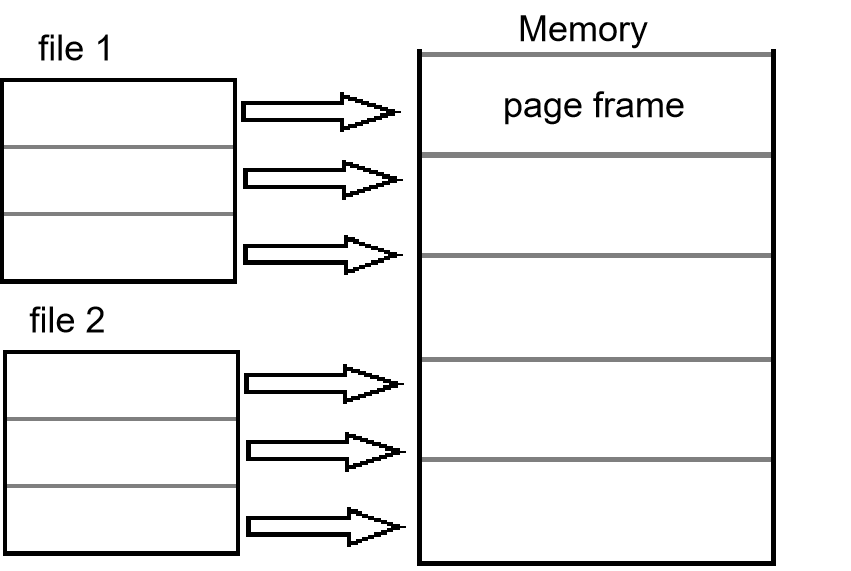
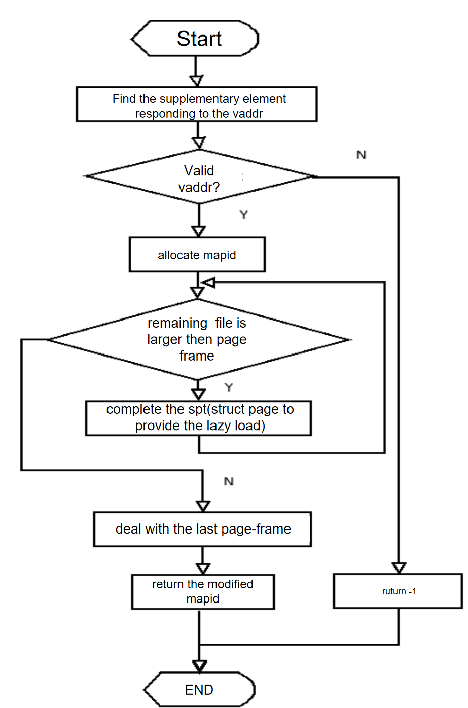
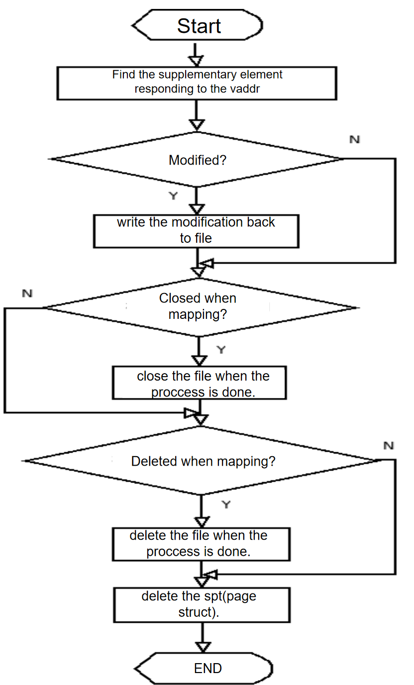
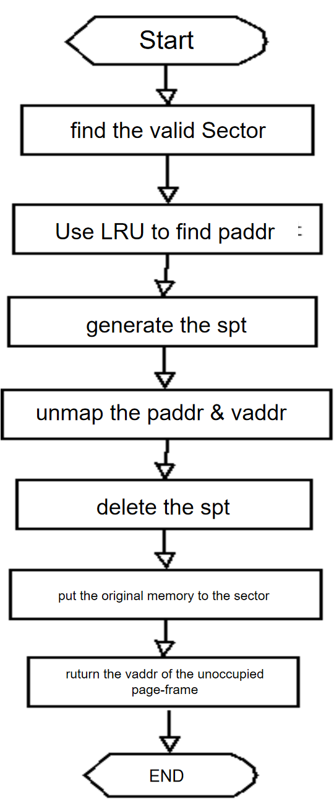
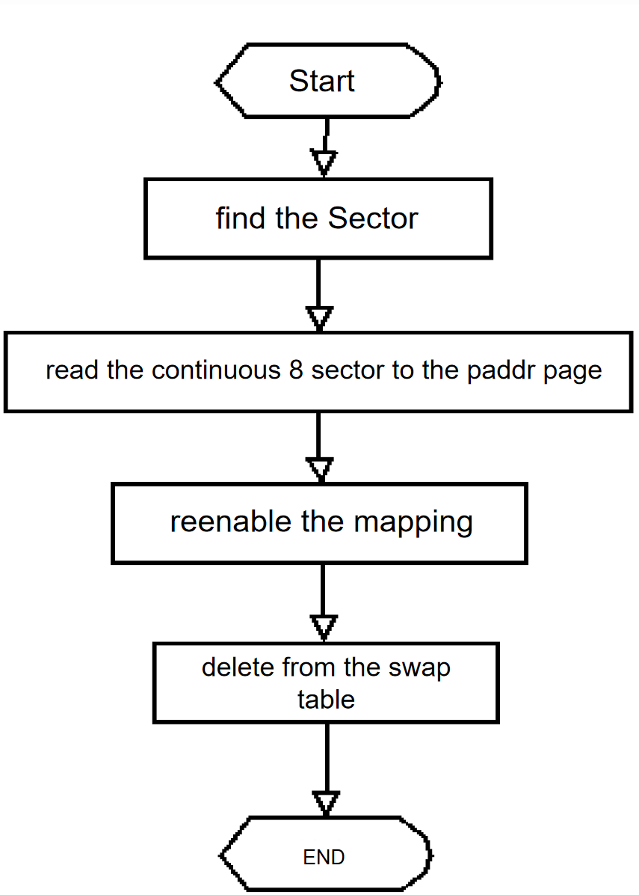

# Project 3: Virtual Memory

## Group 20

- Yiwei Yang <yangyw@shanghaitech.edu.cn>
- Yuqing Yao <yaoyq@shanghaitech.edu.cn>

## Page Table Management

### Data Structures

- `struct page`
  In the struct, we use `hash_elem` to store the pages, `bool read_only` to get whether read-only, `void *addr` as user virtual addr, `struct thread *thread` to store the owning thread, `block_sector_t sector` ro store swap information which is protected by frame->frame_lock. Also, we have `struct file *file` to store the Memory-mapped file information and `bool private` to store whether is to file or to swap.

- `hash_hash_func page_hash` & `hash_less_func page_less`
  We can get O(1) in finding the page-frame relations.

- `struct hash *page`

  hash structure to implement frame.

### Algorithms

- `void page_exit (void)`
  Destroys the current process's page table.

- `struct page *page_allocate (void *, bool read_only)`

  Adds a mapping for user virtual address VADDR to the page hashtable. Fails if VADDR is already mapped or if memory allocation fails.

- `void page_deallocate (void *vaddr)`

  Evicts the page containing address VADDR and removes it from the page table.

- `bool page_in (void *fault_addr)`
  `bool page_out (struct page *)`
  `bool page_accessed_recently (struct page *)`

  `bool page_lock (const void *, bool will_write)
  void page_unlock (const void *)`

  The function above is the meaning of their name.

- `static struct frame *try_frame_lock (struct page *page) `

  Tries to allocate and lock a frame for PAGE. Returns the frame if successful, false on failure.

- `struct frame *frame_alloc_and_lock (struct page *page) `

  Tries really hard to allocate and lock a frame for PAGE. Returns the frame if successful, false on failure.

- if (`user && not_present`)

  { if (!page_in (fault_addr))

   thread_exit ();

   return;}

  To implement virtual memory, delete the rest of the function body, and replace it with code that brings in the page to which fault_addr refers.
  
  We use the function that asked whether user and in 8m and no page_fault to determine whether is stack.

#### In a few paragraphs, describe your code for accessing the data stored in the SPT about a given page.

Each page struct has a number of associated members, including the frame struct that contains its physical data. The frame struct contains a pointer to the kernel virtual address holding its data, and a reference to the page that owns it. When the page is initially created, its frame is set to NULL -- it doesn't receive a frame until allocated one via the `frame_alloc_and_lock()` function in 'frame.c' (called by the `do_page_in()` function).

The process of finding a free frame in memory is conducted by `frame_alloc_and_lock()`. It makes multiple attempts to secure a free region of memory in which to allocate the new frame. If no frame sized piece of memory exists, then an existing frame must be evicted to make room for the new one. Upon finding/creating a new frame, the frame is returned and associated with the page that requested it (`p->frame = frame` and `f->page = page`). If for some reason `frame_alloc_and_lock()` is unable to find an existing frame to evict, `NULL` is returned and no frame is allocated.

#### How does your code coordinate accessed and dirty bits between kernel and user virtual addresses that alias a single frame, or alternatively how do you avoid the issue?

We avoid this issue by only accessing the virtual address.

### Synchronization

#### When two user processes both need a new frame at the same time, how are races avoided?

Searching into the frame table (usually to find a free frame) is limited to a single process at a time via a lock called `scan_lock`. No two processes can secure the same frame at once, and race conditions are avoided. Additionally, each individual frame contains its own lock (`f->lock`) denoting whether or not it is occupied.

### Rationale

#### Why did you choose the data structure(s) that you did for representing virtual-to-physical mappings?

We use a hash map because it allows an $O(1)$ and space-efficient method for managing the mapped pages of each process. We need to support fast lookups in the mapping, so an $O(1)$ algorithm is necessary and satisfying.

## Paging to and from Disk

### Data Structures

- `struct frame `

  In the struct, we use s`truct lock lock`  to revent simultaneous access.  We use `void *base` to store the kernel virtual base address. We use `struct page *page` to store the mapped process page.

  We'll have a fork of page directory every time call `page->pagedir`. 

### Algorithms

- `void frame_init (void)`

  Initialize the frame manager.

- `struct frame *frame_alloc_and_lock (struct page *)`

  Tries to allocate and lock a frame for PAGE.  Returns the frame if successful, false on failure.

- ``void frame_lock (struct page *)`

  Locks P's frame into memory, if it has one. Upon return, p->frame will not change until P is unlocked.

- ``void frame_free (struct frame *)`

  `void frame_unlock (struct frame *)`

  The function above is the meaning of their name.

#### When a frame is required but none is free, some frame must be evicted.  Describe your code for choosing a frame to evict.

The least recently used one. Algorithm implemented in `try_frame_lock()` in `frame.c`.

If the frame being searched for has no page associated with it then we immediately acquire that frame. Otherwise, we acquire the first frame that has not been accessed recently. If all of the frame have been accessed recently, then we iterate over each of the frames again. At this time, it is very likely that a valid frame will be acquired because the `page_accessed_recently()` function changes the access status of a frame upon being called. If for whatwver reason the second iteration yields no valid frames, the `NULL` is returned and no frame is evicted.

#### When a process P obtains a frame that was previously used by a process Q, how do you adjust the page table (and any other data structures) to reflect the frame Q no longer has?

When P obtains a frame that was used by Q, we first pin the frame, acquire the lock for the supplemental page table entry associated with that page, and then remove it from process Q's page table. This means that process Q will fault upon any success to this frame from now, nut it will have to block on acquiring the supplemental page table entry lock before unevicting its frame.

Depending on the property of Q, it will be written to disk or swap.

#### Explain your heuristic for deciding whether a page fault for an invalid virtual address should cause the stack to be extended into the page that faulted.

There are two important checks that must be made before a page is allocated.

1. the address of the page (rounded down to the nearest page boundary) must be within the allocated stack space (which is by default 1 MB).
2. The page address (unrounded) must be within 32 Bytes of the threads' `user_esp`. We do this to account for commands that manage stack memory, including the PUSH and PUSHA commnds that will access at most 32 bytes beyond the stack pointer.

## Synchronization

### Data Structures

- `bool was_accessed`

  A record of recently used information.

- `struct lock frame_lock`
- `struct lock page_lock`

### Algorithm

- `bool page_accessed_recently (struct page *p) `

  Returns true if page P's data has been accessed recently, false otherwise. P must have a frame locked into memory.

- `struct frame *frame_alloc_and_lock (struct page *)`

  Tries really hard to allocate and lock a frame for PAGE. Returns the frame if successful, false on failure.

  

#### Explain the basics of your VM synchronization design.  In particular, explain how it prevents deadlock.  (Refer to the textbook for an explanation of the necessary conditions for deadlock.)

<<<<<<< HEAD
These three parts are ensured not to interact with other parts in terms of lock acquiring. So that we won't have the situation like holding one lock and acquire another lock, which means no deadlock.

1). The table is changed during the access to the frame table, stp, and swap table;
2). Memory mapping files are mapped to overlapping address spaces;
3). Two pieces of real memory are dumped to the same sector;
4). SWAP partition data write back problem.

Solutions:

1. Use pintos lock variables for each supplymentary page table entry   to lock when reading and writing to the memory bank and unlock after reading and writing to achieve a synchronous mutex mechanism.

2. The member variable of struct thread is responsible for the management of the supplementary page table of this process. Since the file mapping information is stored in the supplementary page table entry, it is also responsible for the control of file mapping.
=======
There is an internal lock for frame table and swap table. For supplemental page table, it might be used by other process during eviction, so to avoid confusion and allow synchronization, we add a lock to each supplemental page table entry.

These three parts are ensured not to interact with other parts in terms of lock acquiring. So that we won't have the situation like holding one lock and acquire another lock, which means no deadlock.
>>>>>>> 8410b9ab67fa6b5636dcfe11897f436227ba76b9

#### A page fault in process P can cause another process Q's frame to be evicted.  How do you ensure that Q cannot access or modify the page during the eviction process?  How do you avoid a race between P evicting Q's frame and Q faulting the page back in?

We use pintos lock variables for each supplymentary page table entry to lock when reading and writing to the memory bank and unlock after reading and writing to achieve a synchronous mutex mechanism.

So, when eviction, whe lock is triggered when Q is attempting to modify it.   it will get a page fault and try to look up the supplemental page table entry, then it will be held at acquiring the lock until the end of the eviction.

#### Suppose a page fault in process P causes a page to be read from the file system or swap.  How do you ensure that a second process Q cannot interfere by e.g. attempting to evict the frame while it is still being read in?

There's an internal whether evictable or not variable ` bool private`(False to write back to file,  true to write back to swap.) to store the status in every frame.   The algorithm will recognize the  attribute and prevent it from being evicted.

In that case, when encountering page fault, private is set false before reading from file system or swap. So  we just write back to file. The frame will not be chosen again, thus Q cannot interfere the process/

#### Explain how you handle access to paged-out pages that occur during system calls.  Do you use page faults to bring in pages (as in user programs), or do you have a mechanism for "locking" frames into physical memory, or do you use some other design?  How do you gracefully handle attempted accesses to invalid virtual addresses?

The pages are checked before get into the real functionality of the system call,  if it’s in paged out, it will be brought back. Then the corresponding frames to  the pages are set evict-able flag to false in frame table. When the evicting  process see the flag, it will get pass the frame without considering to evict it.

In checking the paged-out situation, they've been checked during paing out the pages. There's a global function to determined the invalid access. Once detected, they'll be killed at once.

### Rationale

#### A single lock for the whole VM system would make synchronization easy, but limit parallelism.  On the other hand, using many locks complicates synchronization and raises the possibility for deadlock but allows for high parallelism.  Explain where your design falls along this continuum and why you chose to design it this way.

Fistly, because the page table and the swap table is global wide while the supplementary page table is allocated for each process. So in the former two implementation, we add lock, but to avoid the possible situation that the supplementary will be occupied by other process during eviction, we also add a lock in it.

Then, all the locks are internal lock, which implied they are inside the struct of them. That assure that none of them will interrupt each other during their lock acuiring. (just like the buy milk third implementation).

## Memory Mapped Files

### Data Structures

- `static struct block *swap_device` &`static struct bitmap *swap_bitmap` & `static struct lock swap_loc`

  Returns the block device fulfilling the given ROLE, or a null pointer if no block device has been assigned that role.

- `struct file *file`

  A pointer to the mapped file

- `off_t file_offset`

  Offset to the head of the mapped file.  Because the size of a file is different, a large file may be mapped into multiple page frames, so an offset is required to determine the content of the file to which this page frame is mapped.

- `bool private`        

  False to write back to file, true to write back to swap.

  Mark what the file needs to do when the mapping ends.

  Because this project requires the mapping of files to memory to be maintained until the call of MUNMAP, or the process exits, the operations related to file deletion and file deletion in this process need to be postponed. These two data structures are used to notify when the mapping ends. The operating system has to do these two operations

- `block_sector_t sector`

   Get the return value of the MMAP system call, this value is also the index entry of the unmapping relationship.

### Algorithms

Use the system call mechanism to implement memory mapping files, and map a file to a continuous memory space. Since the system uses a paging mechanism, pay special attention to the file size and page frame size, and use 0 to fill the remaining space on the last page. Due to the independence of the user's address space, the file mapping information is saved by the user process, as shown in the following figure.

#### Basic algorithm

The following tow we just made them a syscall, which is called globally.

#### algorithm of file to memory mapping

#### algorithm of unmap

#### algorithm of replace

#### algorithm of write back

#### Describe how memory mapped files integrate into your virtual memory subsystem.  Explain how the page fault and eviction processes differ between swap pages and other pages.

Memory mapped files are encapsulated in a struct called `mapping` in `syscall.c`. Each thread contains a list of all of the files mapped to that thread, which can be used to manage which files are present directly in memory. Otherwise, the pages containing memory mapped file information are managed just the same as any other page.

The page fault and eviction process differs slightly for pages belonging to memory mapped files. Non-file related pagesare moved to a swap partition upon eviction, regardless of whether or not the page is dirty. When evicted, memory mapped file pages must only be written back to the file if modified. Otherwise, no writing is necessary -- the swap partition is avoided all together for memory mapped files.

#### Explain how you determine whether a new file mapping overlaps another segment, either at the time the mapping is created or later.

Pages for a new file mapping are only allocated if pages are found that are free and unmapped. The `page_allocated()` function has access to existing file mappings, and will refuse to allocate any space that is already occupied. If a new file attemps to infringe upon already mapped space, it is immediately unmapped and the process fails.

### Rationale

#### Mappings created with "mmap" have similar semantics to those of data demand-paged from executables, except that "mmap" mappings are written back to their original files, not to swap.  This implies that much of their implementation can be shared.  Explain why your implementation either does or does not share much of the code for the two situations.

The code is largely shared between processes. Any page, regardless of origin, will ultimately be pages out via the same `page_out()` function in `page.c`. The only difference is a check to see whether or not the page should be written back out of disk. If the page is marked as private then it should be swapped to the swap partition, otherwise it should be written out to the file on the disk. This makes it easier than writing separately for different page types.